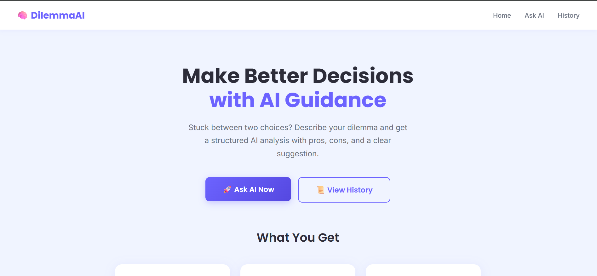
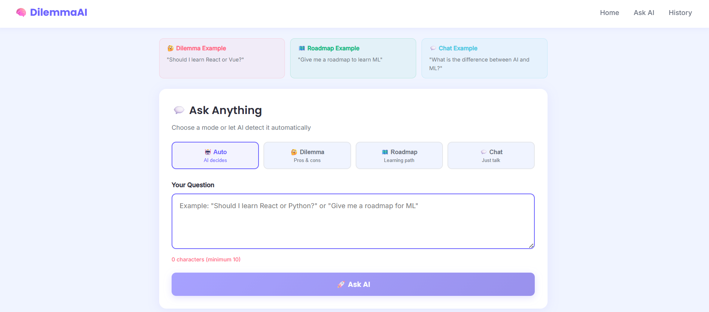
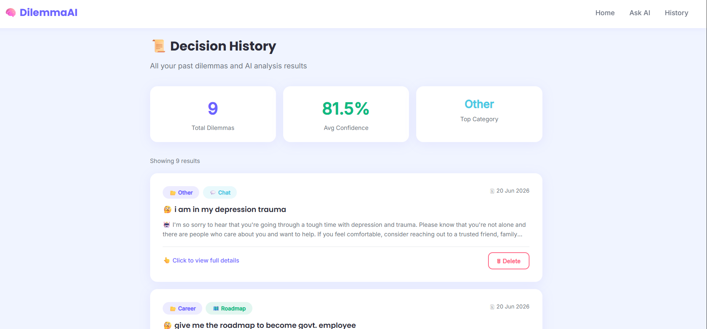

# 🧠 AI Decision Helper

An AI-powered decision support system that analyzes user dilemmas, generates structured learning roadmaps, and supports general conversation using a full-stack MERN architecture with Groq AI integration.

---

## 📸 Screenshots

### 🏠 Home Page


### 🤔 Ask Page


### 📜 History Page


---

## 🎯 Features

- 🤔 **Dilemma Analysis** — Get structured pros, cons, suggestions and confidence score
- 🗺️ **Learning Roadmap** — Generate phase-wise learning paths with topics and resources
- 💬 **AI Chat** — Have a general conversation with AI
- 🤖 **Auto Mode Detection** — AI automatically detects what type of response you need
- 📜 **Decision History** — All past queries saved and accessible anytime
- 📊 **Stats Dashboard** — View total decisions, average confidence and top categories
- 🗑️ **Delete** — Remove any past decision from history

---

## 🛠️ Tech Stack

### Frontend
| Technology | Purpose |
|---|---|
| React.js | UI development |
| React Router DOM | Page navigation |
| Axios | API calls to backend |
| Vite | Frontend build tool |

### Backend
| Technology | Purpose |
|---|---|
| Node.js | Server runtime |
| Express.js | REST API framework |
| MongoDB | Database |
| Mongoose | MongoDB object modeling |
| Groq AI API | AI response generation |

---

## 📁 Project Structure

```
AI_DECISION_ANALYSER/
│
├── backend/
│   ├── config/
│   │   └── db.js                 → MongoDB connection
│   ├── controllers/
│   │   └── dilemmaController.js  → Request/response logic
│   ├── models/
│   │   └── Dilemma.js            → MongoDB schema
│   ├── routes/
│   │   └── dilemmaRoutes.js      → API endpoints
│   ├── services/
│   │   └── aiService.js          → Groq AI integration
│   ├── server.js                 → Express entry point
│   ├── .env.example              → Environment variables template
│   └── package.json
│
└── frontend/
    ├── src/
    │   ├── components/
    │   │   ├── DilemmaForm.jsx   → Input form with mode selector
    │   │   ├── ResultCard.jsx    → AI result display
    │   │   ├── HistoryCard.jsx   → History item card
    │   │   └── Loader.jsx        → Loading animation
    │   ├── pages/
    │   │   ├── Home.jsx          → Landing page
    │   │   ├── AskPage.jsx       → Submit dilemma page
    │   │   ├── HistoryPage.jsx   → Past dilemmas page
    │   │   └── DetailPage.jsx    → Full detail view
    │   ├── services/
    │   │   └── api.js            → Axios API calls
    │   ├── App.jsx               → Routes setup
    │   ├── main.jsx              → React entry point
    │   └── styles.css            → Global styles
    └── package.json
```

---

## ⚙️ Getting Started

### Prerequisites
- Node.js v18+
- MongoDB (local or Atlas)
- Groq API Key → [console.groq.com](https://console.groq.com)

### 1. Clone the Repository

```bash
git clone https://github.com/Rajeshwari8835/AI_DECISION_ANALYSER.git
cd AI_DECISION_ANALYSER
```

### 2. Backend Setup

```bash
cd backend
npm install
```

Create a `.env` file inside `backend/`:

```env
PORT=5000
MONGO_URI=mongodb://localhost:27017/ai-decision-helper
GROQ_API_KEY=your_groq_api_key_here
NODE_ENV=development
```

Start the backend:

```bash
npm run dev
```

### 3. Frontend Setup

```bash
cd frontend
npm install
npm run dev
```

Open your browser and go to:

```
http://localhost:5173
```

---

## 🔌 API Endpoints

| Method | Endpoint | Description |
|--------|----------|-------------|
| GET | `/` | Health check |
| POST | `/api/dilemmas` | Analyze a new dilemma |
| GET | `/api/dilemmas` | Get all past dilemmas |
| GET | `/api/dilemmas/stats` | Get stats |
| GET | `/api/dilemmas/:id` | Get single dilemma |
| DELETE | `/api/dilemmas/:id` | Delete a dilemma |

---

## 🧠 How It Works

```
User types question
       ↓
Frontend sends to backend (Axios)
       ↓
Backend detects mode (Dilemma / Roadmap / Chat)
       ↓
Backend sends prompt to Groq AI API
       ↓
Groq AI returns structured JSON
       ↓
Backend saves to MongoDB
       ↓
Frontend displays result
```

---

## 🤖 AI Modes

| Mode | Trigger Example | Response |
|------|----------------|----------|
| 🤔 Dilemma | "Should I learn React or Python?" | Pros, Cons, Suggestion, Confidence Score |
| 🗺️ Roadmap | "Give me a roadmap to learn ML" | Phases, Topics, Duration, Resources |
| 💬 Chat | "What is machine learning?" | Conversational AI reply |

---

## 🌱 Environment Variables

| Variable | Description |
|----------|-------------|
| `PORT` | Backend server port (default 5000) |
| `MONGO_URI` | MongoDB connection string |
| `GROQ_API_KEY` | Your Groq AI API key |
| `NODE_ENV` | development or production |

---

## 🚀 Live Demo
Coming soon after deployment


## 👨‍💻 Author

**Rajeshwari**
- GitHub → [@Rajeshwari8835](https://github.com/Rajeshwari8835)

---

## 📄 License

This project is open source and available under the [MIT License](LICENSE).
